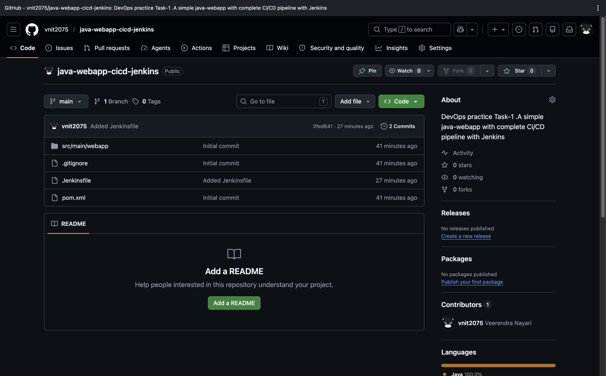
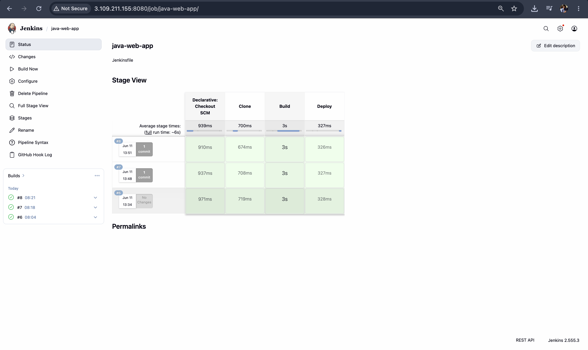
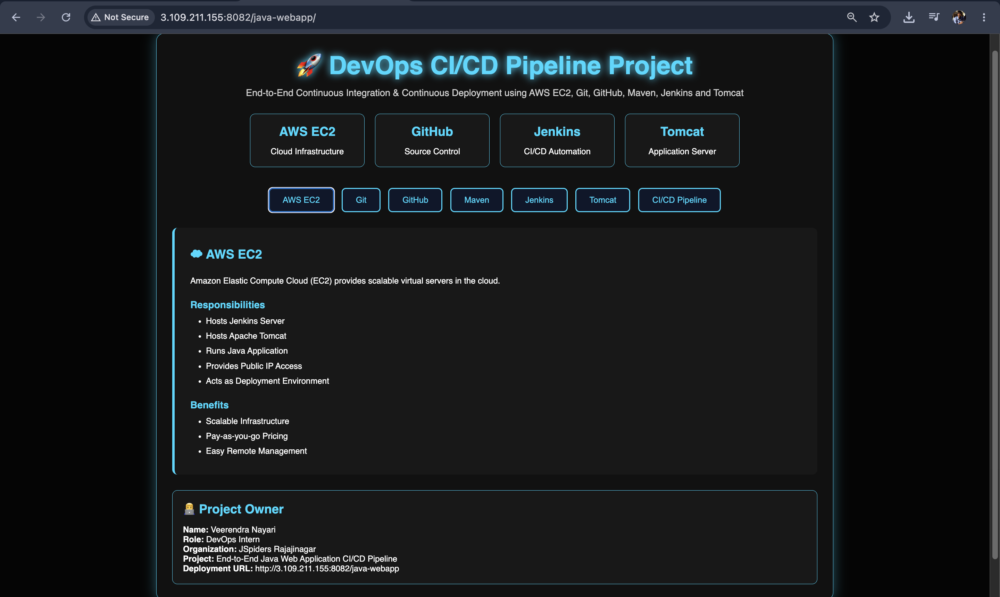

# 🚀 Java WebApp CI/CD Pipeline with Jenkins

A simple Java Maven Web Application deployed automatically using a complete CI/CD pipeline built with Jenkins and Apache Tomcat.

---

## 📌 Project Objective

This project demonstrates an end-to-end CI/CD pipeline for a Java web application.

Whenever code is pushed to GitHub:

1. Jenkins pulls latest code
2. Maven builds the application
3. WAR file is generated
4. Application is deployed to Tomcat
5. Users can access the updated application

---

## 🛠 Tools & Technologies

- Java
- Maven
- Jenkins
- Git
- GitHub
- Apache Tomcat
- AWS EC2
- Linux (Ubuntu)

---

## 📂 Project Structure

```text
java-webapp-cicd-jenkins/
│
├── src/
│   └── main/webapp/
│       └── index.jsp
│
├── pom.xml
├── Jenkinsfile
└── README.md
```

---

## ⚙️ CI/CD Workflow

```text
Developer
    ↓
GitHub Repository
    ↓
Jenkins Pipeline
    ↓
Maven Build
    ↓
WAR File Generation
    ↓
Apache Tomcat Deployment
    ↓
Application Live
```

---

## 📜 Jenkins Pipeline

Stages:

- Checkout Source Code
- Build using Maven
- Package WAR File
- Deploy to Tomcat

Example:

```groovy
pipeline {
    agent any

    stages {

        stage('Checkout') {
            steps {
                git 'YOUR_GITHUB_REPO_URL'
            }
        }

        stage('Build') {
            steps {
                sh 'mvn clean package'
            }
        }

        stage('Deploy') {
            steps {
                sh 'cp target/*.war /opt/tomcat/webapps/'
            }
        }
    }
}
```

---

## 📸 Screenshots

### GitHub Repository



---

### Successful Build



---

### Application Homepage



---

## 🚀 How to Run

Clone Repository

```bash
git clone https://github.com/vnit2075/java-webapp-cicd-jenkins.git
```

Move into Project

```bash
cd java-webapp-cicd-jenkins
```

Build Application

```bash
mvn clean package
```

Deploy WAR

```bash
cp target/*.war /tomcat/webapps/
```

Access Application

```text
http://SERVER_IP:8082/
```

---

## ✅ Results

Successfully implemented:

- GitHub Version Control
- Jenkins Automation
- Maven Build Process
- Tomcat Deployment
- End-to-End CI/CD Pipeline

---

## 👨‍💻 Author

**Veerendra Nayari**

GitHub:
https://github.com/vnit2075
